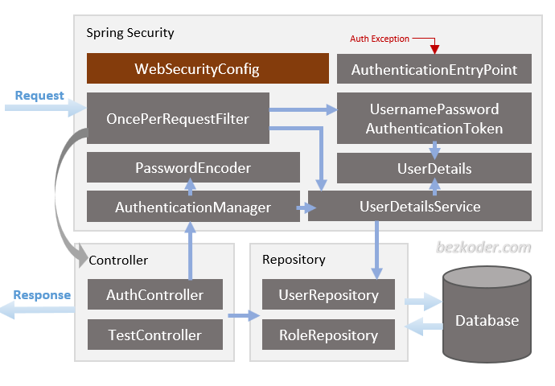
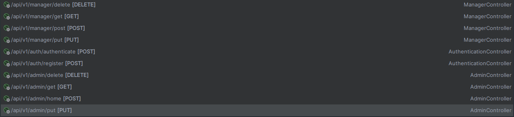
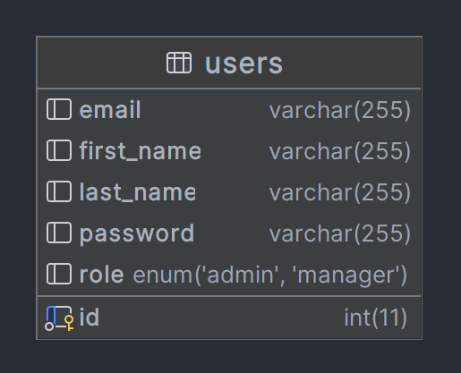

<a name="readme-top"></a>

<!-- PROJECT LOGO -->
<br />
<div align="center">
  <a href="https://github.com/kudzaiprichard/springboot-jwt-auth">
    
  </a>

  <h3 align="center">JWT Auth</h3>

  <p align="center">
    A simple implementation of spring security using jason web tokens
    <br />
  </p>
  <br/>
</div>

<!-- TABLE OF CONTENTS -->
<details>
  <summary>Table of Contents</summary>
  <ol>
    <li>
      <a href="#about-the-project">About The Project</a>
      <ul>
        <li><a href="#what-is-jwt-authentication">What is JWT Authentication?</a></li>
        <li><a href="#defining-terminology">Defining Terminology</a></li>
        <li><a href="#project-design">Project Design</a></li>
        <li><a href="#built-with">Built With</a></li>
      </ul>
    </li>
    <li>
      <a href="#getting-started">Getting Started</a>
      <ul>
        <li><a href="#prerequisites">Prerequisites</a></li>
        <li><a href="#installation">Installation</a></li>
        <li><a href="#contributing">Contributing</a></li>
      </ul>
    </li>
    <li><a href="#license">License</a></li>
    <li><a href="#contact">Contact</a></li>
    <li><a href="#acknowledgments">Acknowledgments</a></li>
  </ol>
</details>

<!-- ABOUT THE PROJECT -->
# About The Project
## What is JWT Authentication?
`JSON Web Tokens` are an open, industry `standard RFC 7519` method for representing claims securely between two parties. When we create `REST APIs`, then we don't want that any one can access those apis. `REST APIs`, will only be accessed by the authenticated user. We `authenticate` our user with the help of `jwt`.

## Defining Terminology
These are the terms we need to address:

* `Authentication` refers to the process of verifying the identity of a user, based on provided credentials. A common example is entering a username and a password when you log in to a website. You can think of it as an answer to the question Who are you?.
* `Authorization` refers to the process of determining if a user has proper permission to perform a particular action or read particular data, assuming that the user is successfully authenticated. You can think of it as an answer to the question Can a user do/read this?.
* `Principle` refers to the currently authenticated user.
* `Granted authority` refers to the permission of the authenticated user.
* `Role` refers to a group of permissions of the authenticated user.

## Project Design
### Architecture
<div align="center">
    
</div>

* `WebSecurityConfig` is the crux of our security implementation. It configures cors, csrf, session management, rules for protected resources. 
* `UserDetailsService` interface has a method to load User by username and returns a `UserDetails` object that Spring Security can use for authentication and validation.
* `UserDetails` contains necessary information (such as: username, password, authorities) to build an `Authentication` object.
* `UsernamePasswordAuthenticationToken` gets {username, password} from login Request, `AuthenticationManager` will use it to authenticate a login account.
* `AuthenticationManager` has a `DaoAuthenticationProvider` (with help of `UserDetailsService` & `PasswordEncoder`) to validate `UsernamePasswordAuthenticationToken` object. If successful, `AuthenticationManager` returns a fully populated `Authentication` object (including granted authorities).
* `OncePerRequestFilter` makes a single execution for each request to our API. It provides a doFilterInternal() method that we will implement parsing & validating JWT, loading User details (using UserDetailsService), checking `Authorization` (using `UsernamePasswordAuthenticationToken`).
* `AuthenticationEntryPoint` will catch authentication error. Repository contains `UserRepository` & `RoleRepository` to work with Database, will be imported into `Controller`.Controller receives and handles request after it was filtered by `OncePerRequestFilter`.
* `AuthController` handles signup/login requests
* `TestController` has accessing protected resource methods with role based validations.

### Security filter chain
Spring Security maintains a filter chain internally where each of the filters has a particular responsibility and 
filters are added or removed from the configuration depending on which services are required. The ordering of the 
filters is important as there are dependencies between them.

<div align="center">

</div>

The client sends a request to the application, and the container creates a `FilterChain`, 
which contains the `Filter` instances and `Servlet` that should process the `HttpServletRequest`, 
based on the path of the request URI. In a Spring MVC application, the `Servlet` is an instance of `DispatcherServlet`.
At most, one `Servlet` can handle a single `HttpServletRequest` and `HttpServletResponse`. However, more than one `Filter` can be used to:

* Prevent downstream `Filter` instances or the `Servlet` from being invoked. In this case, the `Filter` typically writes the `HttpServletResponse`.

* Modify the `HttpServletRequest` or `HttpServletResponse` used by the downstream `Filter` instances and the `Servlet`.

The power of the `Filter` comes from the `FilterChain` that is passed into it.


When you add the Spring Security framework to your application, it automatically registers a filters chain that intercepts 
all incoming requests. This chain consists of various filters, and each of them handles a particular use case.

For example:

* Check if the requested URL is publicly accessible, based on configuration.
* In case of session-based authentication, check if the user is already authenticated in the current session.
* Check if the user is authorized to perform the requested action, and so on.

### Endpoit Design
Below is a screenshot of the project user creation and authentication restful api endpoints and the HTTP Method supported by each endpoint



### UML Diagram
System uses a single user table for user creation and authentication
<div align="center">
    
</div>

### Sequence Diagram
Sequence diagram showing how you can create an account, login and access a `secured 
restfull endpoint/resource` using a `jwt token` you get when you `authenticate` your account.
<div align="center">
    
</div>>

### Built With
Used `Java` `spring boot` , `MySQL` and `Jason Web Token` to build the rest api, including postman for testing.

<div align="center">
 
     
    
    
</div>

<p align="right">(<a href="#readme-top">back to top</a>)</p>

<!-- GETTING STARTED -->
## Getting Started

### Prerequisites

You should have the below software installed in your pc :
* JDK 20 and JRE
* MySQL
* and your preferred IDE or text editor

  

### Installation

1. Get a free API Key at [https://github.com/settings/tokens](https://github.com/settings/tokens)
2. Clone the repo

   ```sh
   git clone https://github.com/kudzaiprichard/springboot-jwt-auth
   ```

3. Open project in IDE or text editor
4. Let maven download all necessary dependency for the project to run


<p align="right">(<a href="#readme-top">back to top</a>)</p>


<!--CONTRIBUTING-->
## Contributing

If you have a suggestion that would make this better, please fork the repo and create a pull request. You can also simply open an issue with the tag "enhancement".
Don't forget to give the project a star! Thanks again!

1. Fork the Project
2. Create your Feature Branch (`git checkout -b feature/ExampleFeature`)
3. Commit your Changes (`git commit -m 'Add some ExampleFeature'`)
4. Push to the Branch (`git push origin feature/ExampleFeature`)
5. Open a Pull Request

### :fire: Contribution

 Your contributions are always welcome and appreciated. Following are the things you can do to contribute to this project.

 1. **Report a bug** <br>
 If you think you have encountered a bug, and I should know about it, feel free to report it [here]() and I will take care of it.

 2. **Request a feature** <br>
 You can also request for a feature [here](), and if it will viable, it will be picked for development.  

 3. **Create a pull request** <br>
 It can't get better than this, your pull request will be appreciated by the community. You can get started by picking up any open issues from [here]() and make a pull request.

 > If you are new to open-source, make sure to check read more about it [here](https://www.digitalocean.com/community/tutorial_series/an-introduction-to-open-source) and learn more about creating a pull request [here](https://www.digitalocean.com/community/tutorials/how-to-create-a-pull-request-on-github).

<p align="right">(<a href="#readme-top">back to top</a>)</p>


<!-- LICENSE -->
## License

> Distributed under the MIT License. See `LICENSE.txt` for more information.

<p align="right">(<a href="#readme-top">back to top</a>)</p>


<!-- CONTACT -->
## Contact

>Kudzai P Matizirofa - [linkedin.com/in/kudzai-prichard](www.linkedin.com/in/kudzai-prichard) - <kudzaiprichard@gmail.com>

Project Link: [https://github.com/kudzaiprichard/springboot-jwt-auth](https://github.com/kudzaiprichard/springboot-jwt-auth)

<p align="right">(<a href="#readme-top">back to top</a>)</p>

<!-- ACKNOWLEDGMENTS -->
## Acknowledgments

list of resources I found helpful and would like to give credit to.
* [Spring Security with JWT for REST API](https://www.toptal.com/spring/spring-security-tutorial#:~:text=Spring%20Security%20Filters%20Chain&text=This%20chain%20consists%20of%20various,authenticated%20in%20the%20current%20session.)
* [Choose an Open Source License](https://choosealicense.com)
* [Restful Api Explained](https://aws.amazon.com/what-is/restful-api/)
* [Jason Web Tokens](https://jwt.io/)
* [Spring Boot docs](https://docs.spring.io/spring-boot/docs/current/reference/htmlsingle/)
* [GitHub Pages](https://pages.github.com) 
* [MySql docs](https://dev.mysql.com/doc/)

<p align="right">(<a href="#readme-top">back to top</a>)</p>

